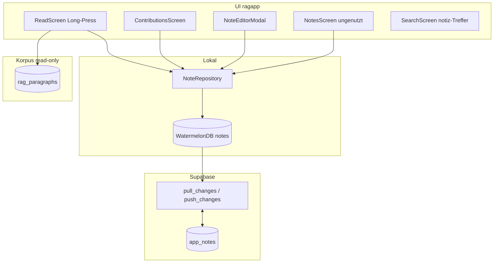

# Analyse: Behandlung von Notizen

Ziel dieses Dokuments: Eine codebase-basierte technische Analyse der Benutzer-Notizen in ragapp — Datenmodell, Sync, UI-Flows, Abgrenzung zu verwandten Konzepten und bekannter Ist-Zustand inkl. offener Punkte.

## Analyse Version 1.0 (codebase-basiert, Stand Juni 2026)

---

## 1. Einleitung

**Benutzer-Notizen** sind persönliche Anmerkungen, die ein Leser an einzelnen Absätzen eines Werks hinterlässt. Sie sind ein **ragapp-Feature**: lokal in WatermelonDB gespeichert, bidirektional mit Supabase (`app_notes`) synchronisiert. Es gibt **keinen REST-Endpoint** in ragrun und keine Notizen-Logik in ragkeep.

Die App behandelt Notizen **local-first**: Erstellung und Bearbeitung funktionieren offline; Sync läuft nach Login über Postgres-RPCs (`pull_changes` / `push_changes`).

**Haupt-UX-Pfade:**

- Long-Press im Lesen-Tab → Notiz erstellen
- Lesen → Beiträge → Notizen (pro Absatz auflisten, bearbeiten, löschen)
- Suche → Filter „Notiz“ (separater Pfad, Korpus-Treffer aus ragrun — nicht lokale Notizen)

Roadmap und Phasen: siehe [`plans/ragapp-gesamtplan.md`](ragapp-gesamtplan.md).

---

## 2. Begriffsklärung

Im Ökosystem existieren drei unterschiedliche „Note“-Konzepte, die nicht verwechselt werden dürfen:

| Begriff | Ort | Bedeutung |
|---------|-----|-----------|
| **Benutzer-Notizen** (`app_notes` / WDB `notes`) | ragapp + Supabase | Persönliche Anmerkungen des Lesers an Absätzen |
| **Korpus-Annotationen** (`rag_paragraphs.annotations`) | ragprep → Supabase | Redaktionelles Markup: Kursiv, Zitate, Seitenverweise |
| **Buch-Fußnoten** (`note-mode` in `book-manifest.yaml`) | ragkeep / ragprep | Verlags- und OCR-Fußnoten beim Buchaufbereitungsprozess |

**ragrun** teilt die Supabase-Instanz mit ragapp, besitzt aber **keine** `app_notes`-Tabelle, **keine** Notizen-API und **keine** Notizen-Services. Korpus-Daten (`rag_paragraphs`, `rag_chunks`) werden von ragprep/ragrun geschrieben und von der App nur gelesen (Pull-Sync bzw. API).

Weitere Homonyme (nicht Benutzer-Notizen):

| Begriff | Ort | Bedeutung |
|---------|-----|-----------|
| `llm_pricing.note` | ragrun Postgres | Admin-Kommentar zu Preisdaten |
| Benchmark-Feld `"notes"` | ragkeep | LLM-Judge-Zusammenfassung in Embedder-Benchmarks |
| `chunk_type: 'notiz'` | ragrun Suche | Korpus-Suchtreffer (Anzeige in SearchScreen) |

---

## 3. Architektur-Überblick



**Sync-Grenze:** Nur `app_notes` und `app_bookmarks` sind bidirektional. `rag_paragraphs`, `rag_talks`, `rag_turns`, `rag_references` werden serverseitig geschrieben und nur gepullt.

---

## 4. Datenmodell

### 4.1 Semantischer Absatz-Anker

Notizen verweisen optional auf einen Absatz über `paragraph_id`:

```
{source_id}:{segment_index}:{paragraph_number}
```

Beispiel: `philosophie-der-freiheit:0:1`

Diese ID entspricht:

- `rag_paragraphs.id` in Supabase
- `Paragraph.paragraphId` im WatermelonDB-Modell `Paragraph`

**Nicht** zu verwechseln mit `Paragraph.id` — das ist die WatermelonDB-Zeilen-UUID (intern, nicht semantisch).

### 4.2 Lokale Tabelle `notes` (WatermelonDB)

Quelle: `src/data/db/schema.ts` (Schema-Version 10)

| Spalte | Typ | Index | Beschreibung |
|--------|-----|-------|--------------|
| `user_id` | string | ja | Nutzer-ID (`'local'` bis Auth vollständig) |
| `paragraph_id` | string | ja, optional | Semantischer Absatz-Anker |
| `source_id` | string | optional | Werk-ID (z. B. `philosophie-der-freiheit`) |
| `content` | string | — | Notiztext |
| `is_public` | boolean | — | Immer `false` bei Erstellung |
| `created_at` | number | — | Unix-ms |
| `updated_at` | number | — | Unix-ms |

Modell: `src/data/db/models/Note.ts`

```typescript
@field('user_id')      userId!: string;
@field('paragraph_id') paragraphId!: string | null;
@field('source_id')    sourceId!: string | null;
@field('content')      content!: string;
@field('is_public')    isPublic!: boolean;
```

### 4.3 Remote-Tabelle `app_notes` (Supabase)

Quelle: `supabase/migrations/001_initial_schema.sql`

```sql
CREATE TABLE IF NOT EXISTS app_notes (
  id            text        PRIMARY KEY,   -- WatermelonDB UUID
  user_id       uuid        NOT NULL REFERENCES auth.users (id) ON DELETE CASCADE,
  paragraph_id  text,
  source_id     text,
  content       text        NOT NULL DEFAULT '',
  is_public     boolean     NOT NULL DEFAULT false,
  created_at    timestamptz NOT NULL DEFAULT now(),
  updated_at    timestamptz NOT NULL DEFAULT now(),
  deleted_at    timestamptz                          -- Soft-Delete-Tombstone für Sync
);
```

Indizes: `user_id`, `paragraph_id`, `updated_at`

**RLS:** Voller CRUD nur auf eigene Zeilen (`user_id = auth.uid()`).

**Soft-Delete:** Client ruft `markAsDeleted()` auf; `push_changes` setzt `deleted_at = now()`. Pull liefert gelöschte IDs unter `changes.notes.deleted`.

---

## 5. Repository und API-Schicht

### 5.1 NoteRepository

Datei: `src/data/repositories/NoteRepository.ts`

| Methode | Signatur | Zweck |
|---------|----------|-------|
| `findByParagraph` | `(paragraphId: string) → Promise<Note[]>` | Alle Notizen eines Absatzes, absteigend nach `created_at` |
| `observeBySource` | `(sourceId: string) → Observable<Note[]>` | Reaktive Liste pro Werk (Badges im Lesen-Tab) |
| `observeAll` | `() → Observable<Note[]>` | Alle Notizen |
| `create` | `({ userId, paragraphId?, sourceId?, content }) → Promise<Note>` | Anlegen, `isPublic = false` |
| `update` | `(note, content) → Promise<Note>` | Inhalt ändern |
| `delete` | `(note) → Promise<void>` | Soft-Delete via `markAsDeleted()` |

```typescript
async create(data: { userId: string; paragraphId?: string; sourceId?: string; content: string }): Promise<Note> {
  return database.write(async () =>
    collection.create((note) => {
      note.userId = data.userId;
      note.paragraphId = data.paragraphId ?? null;
      note.sourceId = data.sourceId ?? null;
      note.content = data.content;
      note.isPublic = false;
    }),
  );
}
```

### 5.2 useNotes-Hook

Datei: `src/shared/hooks/useNotes.ts`

Reaktiver Hook mit `observeAll` / `findByParagraph` und delegierten `create`/`update`/`delete`. **Wird von keinem Screen genutzt** — Screens importieren `NoteRepository` direkt.

### 5.3 Kein REST-Endpoint

Notizen werden ausschließlich über WatermelonDB-Sync-RPCs transportiert. ragrun exponiert keine `/notes`- oder `/app/notes`-Route.

---

## 6. Sync (bidirektional)

### 6.1 Postgres-RPCs

Quelle: `supabase/migrations/002_sync_functions.sql` (aktualisiert in 005–009)

**`pull_changes(last_pulled_at, schema_version)`**

Liefert für den eingeloggten Nutzer:

```json
{
  "notes": {
    "created": [...],
    "updated": [...],
    "deleted": ["uuid1", "uuid2"]
  }
}
```

Filter: `user_id = auth.uid()`, Zeitfenster über `created_at` / `updated_at` / `deleted_at`, aktive Zeilen mit `deleted_at IS NULL`.

**`push_changes(changes, last_pulled_at)`**

- `notes.created` → `INSERT INTO app_notes`
- `notes.updated` → `UPDATE app_notes`
- `notes.deleted` → `UPDATE app_notes SET deleted_at = now()`

`user_id` wird serverseitig aus `auth.uid()` gesetzt — Client liefert nur die übrigen Felder.

### 6.2 Client-Sync

Datei: `src/data/lib/sync.ts`

```typescript
await synchronize({
  database,
  pullChanges: async ({ lastPulledAt, schemaVersion }) => {
    const { data, error } = await supabase.rpc('pull_changes', { ... });
    return { changes: data.changes, timestamp: data.timestamp };
  },
  pushChanges: async ({ changes, lastPulledAt }) => {
    await supabase.rpc('push_changes', { changes, last_pulled_at: lastPulledAt ?? 0 });
  },
});
```

Voraussetzungen: Supabase konfiguriert, aktive Session (`getSession()`).

### 6.3 Sync-Trigger

- Hook: `src/shared/hooks/useSync.ts`
- Auslöser: Konto-Screen (`KontoScreen.tsx`) — manueller Sync-Button
- Geplant (Gesamtplan): aktiver Flush beim App-Backgrounding

`app_notes` und `app_bookmarks` sind die **einzigen bidirektionalen** Sync-Tabellen.

---

## 7. UI-Flows und Code-Stellen

### 7.1 Lesen → Notiz erstellen (Hauptpfad)

Datei: `src/features/read/ReadScreen.tsx`

1. Long-Press auf Absatz → Kontextmenü
2. „Notiz erstellen" → Inline-`TextInput` im Bottom-Sheet
3. Speichern → `NoteRepository.create(...)`
4. Optional: `openContributions(paragraph, 'notes')` öffnet Beiträge-Overlay

**Badge-Zählung:** `NoteRepository.observeBySource(sourceId)` baut eine `noteCounts`-Map:

```typescript
for (const n of notes) {
  if (n.paragraphId) counts.set(n.paragraphId, (counts.get(n.paragraphId) ?? 0) + 1);
}
```

**Problematischer Create-Aufruf** (siehe Abschnitt 9):

```typescript
await NoteRepository.create({
  userId: LOCAL_USER,
  paragraphId: paragraph.id,        // WDB-UUID — sollte paragraph.paragraphId sein
  segmentId: `${sourceId}:${paragraph.segmentIndex}`,  // wird ignoriert
  sourceId: sourceId,
  content: trimmed,
});
```

`LOCAL_USER` ist hardcoded als `'local'`.

### 7.2 Lesen → Beiträge → Notizen

Datei: `src/features/read/ContributionsScreen.tsx`

- Overlay, eingebunden in `app/(tabs)/_layout.tsx`
- Tab-Steuerung: `ReadingContext` (`ContributionsTab = 'notes' | 'conversations'`)
- Lädt Notizen via `NoteRepository.findByParagraph(paragraph.paragraphId)` — **semantische ID**
- Reaktives Refresh über `observeBySource(sourceId)`
- **Auth-Gate:** ohne Login Hinweis statt Notizenliste
- Erstellen/Bearbeiten: `NoteEditorModal` mit `paragraphId={paragraph.paragraphId}`
- Löschen: `confirmDeleteNote()` → natives Alert

Datei: `src/shared/components/NoteEditorModal.tsx`

- Gemeinsamer Editor für ReadScreen, ContributionsScreen, NotesScreen
- Create mit `paragraphId`, `segmentId`, `sourceId` — `segmentId` wird vom Repository nicht persistiert
- `LOCAL_USER = 'local'` auch hier

Datei: `src/shared/lib/confirmDeleteNote.ts` — Bestätigungsdialog vor `NoteRepository.delete`.

### 7.3 ContributionStrip und Icons

- `src/shared/components/ContributionStrip.tsx` — Icon-Streifen mit Notiz-/Gesprächs-Zähler
- `src/shared/theme/icons.ts` — `contributionIcon('notes')` → `edit`
- `src/shared/theme/semantic.ts` — `textStyles.noteBody`, `noteMeta`

### 7.4 Werk-Übersicht (ungenutzt)

Datei: `src/features/notes/NotesScreen.tsx`

- Gruppiert Notizen nach Kapitel (`segmentIndex` aus `paragraph_id` geparst)
- Hardcoded `SOURCE_ID = 'philosophie-der-freiheit'`
- **Nicht** in `app/(tabs)/_layout.tsx` eingebunden — kein Tab, keine Route

### 7.5 Suche (separater Pfad)

Dateien:

- `src/features/search/SearchScreen.tsx` — Filter-Typ `notiz`
- `src/shared/lib/notizSearchCard.ts` — `buildNotizCardRows()`, `buildNotizSourceContextLine()`
- `src/shared/lib/searchHitCard.ts` — Mapping `notiz` → Kartenzeilen
- `src/shared/components/EntityResultCard.tsx` — Rendert `notizRows`
- `src/shared/types/ragrun.ts` — `note_author`, `note_date` auf `SearchResult`; `note_id` auf `ChatContextIds`

Dieser Pfad zeigt **Korpus-Suchtreffer** aus `ragrunApi.search()` (`chunk_type: 'notiz'`). Es gibt **keine Verknüpfung** zu lokalen `app_notes`.

### 7.6 Design-Referenzen

| Datei | Inhalt |
|-------|--------|
| `design/figma/inventory.md` | Notizen kein Haupt-Tab; unter Lesen → Beiträge |
| `design/icons.md` | `contribution.notes` Icon-Key |
| `plans/ragapp-gesamtplan.md` | Vollständige Spezifikation, Sync-Tabelle, Phasen 2–3 |
| `ARCHITECTURE.md` | `NoteRepository` in Architekturübersicht |

---

## 8. Abgrenzung: Korpus-Annotationen

Benutzer-Notizen sind **nicht** dasselbe wie redaktionelles Absatz-Markup im Korpus.

| Schicht | Datei | Rolle |
|---------|-------|-------|
| Pipeline | `ragprep/src/cli/commands/textAnnotate/` | `text:annotate` — Kursiv, Zitate, Absatznummern |
| Writer | `ragprep/src/lib/supabaseParagraphWriter.ts` | Schreibt `rag_paragraphs` mit `text_raw` + `annotations` JSONB |
| App-Typ | `src/shared/types/index.ts` | `ParagraphAnnotations`: `italics`, `foreign_quotes`, `page_refs` |
| Renderer | `src/shared/components/ParagraphRenderer.tsx` | Inline-Markup aus `text_raw` + `annotations` |

`rag_paragraphs.annotations` ist read-only für die App (Pull-Sync). Der Begriff „annotation" im App-Code bezeichnet **Typografie**, nicht Benutzer-Notizen.

### Buch-Fußnoten (ragkeep)

`book-manifest.yaml` in ragkeep nutzt `note-mode: endnotes`, `footnotes: N`, `footnote-marker-type` usw. Diese werden in ragprep (`ocrFuse`, `textExport`, `FileService`) verarbeitet und haben keinen Bezug zu `app_notes`.

---

## 9. Bekannte Lücken und Inkonsistenzen

| # | Thema | Beschreibung |
|---|-------|--------------|
| 1 | **`paragraphId`-Mismatch** | `ReadScreen` speichert `paragraph.id` (WDB-UUID); `ContributionsScreen` und Badge-Logik erwarten semantische `paragraph.paragraphId`. Notizen aus Long-Press erscheinen ggf. nicht im Beiträge-Overlay und zählen falsch. |
| 2 | **`segmentId` ignoriert** | `ReadScreen` und `NoteEditorModal` übergeben `segmentId`; `NoteRepository.create` akzeptiert und persistiert es nicht. |
| 3 | **`userId: 'local'`** | Hardcoded in UI; echte `auth.uid()` erst nach vollständiger Auth-Integration und Sync-Verdrahtung. |
| 4 | **`is_public`** | Im Schema vorhanden, bei Erstellung immer `false`, keine UI zum Veröffentlichen. |
| 5 | **`NotesScreen` / `useNotes`** | Implementiert, aber nicht in Navigation verdrahtet bzw. von Screens genutzt. |
| 6 | **`note_id` in Chat** | In `ChatContextIds` definiert, in `ChatScreen` noch nicht genutzt (geplante Kontext-Integration). |
| 7 | **DSGVO-Export** | JSON-Export von Notizen im Gesamtplan beschrieben, nicht implementiert. |
| 8 | **Suche vs. lokale Notizen** | `chunk_type: 'notiz'` und `app_notes` sind getrennte Datenquellen ohne Brücke. |

---

## 10. Datei-Index

### Datenbank und Modelle

| Datei | Rolle |
|-------|-------|
| `src/data/db/schema.ts` | WDB-Schema, Tabelle `notes` |
| `src/data/db/models/Note.ts` | WatermelonDB-Modell |
| `src/data/db/models/Paragraph.ts` | `paragraphId` (semantisch) vs. `id` (WDB-UUID) |
| `src/data/db/database.ts` | Registriert `Note`-Modell |
| `supabase/migrations/001_initial_schema.sql` | `app_notes`, RLS, Indizes |
| `supabase/migrations/002_sync_functions.sql` | `pull_changes` / `push_changes` für Notizen |
| `supabase/migrations/005_remove_chunks_from_sync.sql` | Sync-Scope-Anpassungen |
| `supabase/migrations/006_pull_changes_no_timeout.sql` | Pull-Optimierung |
| `supabase/migrations/007_rag_sources.sql` | Korpus-Sync-Erweiterung |
| `supabase/migrations/008_is_primary_sync.sql` | Bookmark-Sync-Feld |
| `supabase/migrations/009_sort_order.sql` | Sortierreihenfolge Sync |

### Repository und Sync

| Datei | Rolle |
|-------|-------|
| `src/data/repositories/NoteRepository.ts` | CRUD + reaktive Queries |
| `src/data/lib/sync.ts` | WatermelonDB ↔ Supabase `synchronize()` |
| `src/shared/hooks/useSync.ts` | Sync-Trigger (Konto) |
| `src/shared/hooks/useNotes.ts` | Hook (ungenutzt) |

### UI und Flows

| Datei | Rolle |
|-------|-------|
| `src/features/read/ReadScreen.tsx` | Long-Press, Inline-Editor, Badge-Zählung |
| `src/features/read/ContributionsScreen.tsx` | Beiträge-Overlay, Notizen-Tab |
| `src/shared/components/NoteEditorModal.tsx` | Gemeinsamer Create/Edit/Delete-Editor |
| `src/shared/lib/confirmDeleteNote.ts` | Lösch-Bestätigung |
| `src/features/notes/NotesScreen.tsx` | Werk-Notizenliste (nicht in Tabs) |
| `src/shared/contexts/ReadingContext.tsx` | `openContributions`, Tab-Typ |
| `src/shared/components/ContributionStrip.tsx` | Icon-Streifen Absatz-Beiträge |
| `app/(tabs)/_layout.tsx` | Mountet Contributions-Overlay |
| `src/features/konto/KontoScreen.tsx` | Sync-Button, Hinweis Notizen-Sync |

### Suche (Korpus-Notizen)

| Datei | Rolle |
|-------|-------|
| `src/features/search/SearchScreen.tsx` | Filter `notiz` |
| `src/shared/lib/notizSearchCard.ts` | Kartenzeilen-Formatierung |
| `src/shared/lib/searchHitCard.ts` | Chunk-Typ → Karte |
| `src/shared/components/EntityResultCard.tsx` | Rendert Notiz-Karten |
| `src/shared/types/ragrun.ts` | `note_author`, `note_date`, `note_id` |

### Theme und Design

| Datei | Rolle |
|-------|-------|
| `src/shared/theme/semantic.ts` | `noteBody`, `noteMeta` Textstile |
| `src/shared/theme/entityCards.ts` | `notiz` Karten-Styling |
| `src/shared/theme/icons.ts` | `contributionIcon('notes')` |
| `design/figma/inventory.md` | UX-Platzierung Notizen |
| `design/icons.md` | Icon-Keys |

### Dokumentation und Pläne

| Datei | Rolle |
|-------|-------|
| `plans/ragapp-gesamtplan.md` | Spezifikation, Sync, Phasen |
| `plans/ragapp-react-native-architecture.md` | Architektur `NoteRepository` |
| `ARCHITECTURE.md` | Projekt-Architekturübersicht |

### Verwandt (nicht Benutzer-Notizen)

| Datei | Rolle |
|-------|-------|
| `src/shared/types/index.ts` | `ParagraphAnnotations` (Korpus-Markup) |
| `src/shared/components/ParagraphRenderer.tsx` | Inline-Typografie |
| `ragprep/src/cli/commands/textAnnotate/` | Korpus-Annotation-Pipeline |
| `ragprep/src/lib/supabaseParagraphWriter.ts` | Schreibt `rag_paragraphs` |
| `ragkeep/books/*/book-manifest.yaml` | `note-mode`, Fußnoten-Metadaten |

---

## 11. Zusammenfassung

Benutzer-Notizen sind ein **local-first ragapp-Feature** mit bidirektionalem Sync über `app_notes` in Supabase. Die zentrale Datenschicht ist `NoteRepository`; die Haupt-UX liegt im Lesen-Tab (Long-Press) und im Beiträge-Overlay. ragrun und ragkeep haben **keine** Benutzer-Notizen-Implementierung — nur Korpus-Markup, Buch-Fußnoten und Such-Treffer vom Typ `notiz`.

Der kritischste offene Punkt ist die **Inkonsistenz bei `paragraph_id`** zwischen `ReadScreen` (WDB-UUID) und `ContributionsScreen` (semantische ID). Eine Korrektur auf durchgängig `paragraph.paragraphId` würde Erstellung, Badges und Beiträge-Liste vereinheitlichen.
