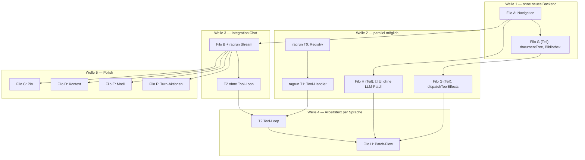

# Filo — Implementationsplan

**Status:** Lebendes Dokument (Reihenfolge & Meilensteine)  
**Zweck:** Eine **einzige Umsetzungsreihenfolge** über ragapp + ragrun — verweist auf Detailpläne, dupliziert sie nicht.

---

## 1. Plandokumente (Rollen)

| Dokument | Repo | Rolle | Wann lesen |
|---|---|---|---|
| **[filo-implementation-plan.md](./filo-implementation-plan.md)** | ragapp | **Diese Datei** — Reihenfolge, Meilensteine, Abhängigkeiten | Immer zuerst |
| [filo-chat-ui-design.md](./filo-chat-ui-design.md) | ragapp | UX, Screens, Datenmodell, Phasen A–H (Checklisten) | UI/Feature-Details |
| [filo-arbeitstext-contract.md](./filo-arbeitstext-contract.md) | ragapp | **Verträge** ragapp↔ragrun (Request, SSE, Tools, Document Tree) | Bei Integration |
| [ragrun-app-tools-architecture.md](../../ragrun/plans/ragrun-app-tools-architecture.md) | ragrun | Tool-Registry, Handler, Tests (T0–T3) | Backend-Tools |
| [llm-model-abstraction.md](./llm-model-abstraction.md) | ragapp | Modell-Katalog, Provider-Abstraktion (post-MVP / Phase E+) | Modell-Settings |
| [NOTIZEN_ANALYSE.md](./NOTIZEN_ANALYSE.md) | ragapp | `app_notes`-Grenzen, Sync, `segment_slug` | Arbeitstext-Daten |
| [new-architecture-watermelondb.md](./new-architecture-watermelondb.md) | ragapp | WDB-Schema, Sync-RPCs | Schema-Migrationen |
| [ragapp-gesamtplan.md](./ragapp-gesamtplan.md) | ragapp | Gesamt-App (Lesen, Sync, Korpus) — Filo ist ein Teilstrang | Kontext |

**Regel:** Änderungen an Request/SSE/Tool-Payloads → nur in **Contract**; UX → Filo-Plan; Handler/Registry → Tools-Plan.

---

## 2. Prinzipien

1. **Reihenfolge nach Risiko**, nicht nach „was am schönsten aussieht".
2. **Backend nicht vor allem** — Navigation und Arbeitstext-UI sind client-only und können zuerst.
3. **Streaming vor Tools** — Phase B liefert RAG-Chat mit leerem `tool_results[]`; Tools kommen danach.
4. **Contract ist die Schnittstelle** — bei Unklarheit Contract § lesen, nicht raten.
5. **Parallele Tracks** — ragapp und ragrun können in derselben Welle unterschiedliche Sprints bearbeiten.

---

## 3. Bereits erledigt

| Was | Wo |
|---|---|
| `notes.segment_slug` (WDB v19 + Supabase) | [NOTIZEN_ANALYSE.md](./NOTIZEN_ANALYSE.md), Filo Phase G |
| DeepSeek v4 Defaults + `thinking.type` (ragrun) | `app/config.py`, `app/core/providers.py` |
| RAG-Architektur entschieden (Graph-Kern + App-Adapter) | Filo §7.1, Contract §6 |
| Contract-Dokument | [filo-arbeitstext-contract.md](./filo-arbeitstext-contract.md) |

---

## 4. Abhängigkeiten (Überblick)



---

## 5. Implementierungswellen

### Welle 1 — Navigation & Shell (nur ragapp)

**User-Wert:** Filo ist Start-Tab; drei Unter-Tabs sichtbar; WEITERLESEN-Hinweis.

| # | Aufgabe | Repo | Referenz |
|---|---|---|---|
| 1.1 | Tab-Reihenfolge, `TAB_INDEX_*` | ragapp | Filo §10 Phase A |
| 1.2 | `ChatScreen` → CHAT / GESPRÄCHE / ARBEITSTEXTE | ragapp | Filo §1, Phase A |
| 1.3 | WEITERLESEN im Filo-Tab | ragapp | Filo Phase A |

**Blockiert durch:** nichts  
**Liefert:** UI-Gerüst für alles Weitere  
**Backend:** nicht nötig  
**Status:** **erledigt** (Jul 2026, lokal uncommitted bis Commit)

---

### Welle 2 — Arbeitstexte (client) + Tool-Gerüst (ragrun)

**User-Wert:** Bibliothek ARBEITSTEXTE, Markdown-Vorschau, manuelles Bearbeiten; optional 📎 verknüpfen (ohne LLM-Patch).

Zwei **parallele Tracks**:

#### Track 2a — ragapp

| # | Aufgabe | Referenz |
|---|---|---|
| 2a.1 | `documentLimits.ts`, `documentTree.ts` | Contract §2, Filo Phase G |
| 2a.2 | `ArbeitstexteScreen`, Filter, Titelsuche, `DocumentMarkdownView` | Filo §5.4, Phase G |
| 2a.3 | `arbeitstextContext.ts` | Filo §5.1, Phase G |
| 2a.4 | Header-📎-Sheet (verknüpfen / neu) | Filo §6, Phase G/H |
| 2a.5 | Preview-Overlay, Rohtext-Editor, Chip (UI only) | Filo Phase H |
| 2a.6 | `applyDocumentUpdate.ts`, `materializeDocument.ts`, `dispatchToolEffects`, `documentUndoStack` | Contract §5, Filo Phase G |

**Status Track 2a:** **erledigt** (Jul 2026). Offen: Kontext-Filter UI (Chip-Leiste → Dropdown rechts, § 5.1 Plan-Ergänzung); Welle 4: `document_outline` im Chat-Request; Doppelmatrix-Fixture-Tests.

| # | Aufgabe | Referenz |
|---|---|---|
| 2a.7 | Kontext-Filter: Dropdown rechts (`Absatz`/`Kapitel`/`Buch`/`Allgemein` + Snippet aus Lese-Kontext) | Filo §5.1 Plan-Ergänzung Jul 2026 |
| 2a.8 | Suchtreffer-📎 (KI-Suche): `AttachTargetSheet`, Navigation-Origin, „ein Arbeitstext pro Einheit"-Lookup + Ersetzen-Dialog | Filo §6.1 Plan-Ergänzung Jul 2026 |
| 2a.9 | Automatisierter Test für `documentTree.ts`/`DocumentMarkdownView` (existiert noch nicht) | Filo §11 Punkt 12 Plan-Ergänzung Jul 2026 |

#### Track 2b — ragrun

| # | Aufgabe | Referenz |
|---|---|---|
| 2b.1 | T0: `app/tools/` Registry | Tools-Plan §12 T0 |
| 2b.2 | T1: `create_document`, `read_blocks`, `update_document` + pytest | Contract §4, Tools §8 |
| 2b.3 | Doppelmatrix-Fixture (ohne Tabellen) | Filo Phase G, Tools T1 |

**Blockiert durch:** Welle 1 (für 📎-Platz im CHAT-Header)
**Backend für 2a:** nicht nötig
**Meilenstein M2:** User kann Arbeitstexte anlegen, filtern, manuell bearbeiten, im Chat verknüpfen

**Hinweis (Jul 2026):** 2b.3 ist die **kleine** pytest-Fixture (`doppelmatrix_excerpt.md`, 2 Kapitel). Die **reale** Doppelmatrix (`ragrun/ragkeep/.../doppelmatrix-gesund-und-krank_matritzen.md`) wurde separat als manuelles E2E-Testdokument für Welle 4 vorbereitet, gekürzt und formatgeprüft (29.220 Zeichen, unter `MAX_DOCUMENT_CHARS`), siehe Filo §11 Punkt 12.

---

### Welle 3 — Streaming-Chat mit RAG (ragrun + ragapp)

**User-Wert:** Filo antwortet streamend mit vollem RAG (wie Agent-Chat), Citations, Persistenz in `rag_talks`/`rag_turns`/`rag_references`.

**Vor Start klären:** RN-SSE-Bibliothek (Filo §11.5) — `react-native-sse` vs. `expo/fetch`.

#### Track 3a — ragrun (kritisch)

| # | Aufgabe | Referenz |
|---|---|---|
| 3a.1 | `app_chat_stream_service.py` (Graph + Adapter) | Filo §7.1, Contract §6 |
| 3a.2 | `_make_llm(model, thinking_type)` | Filo §7.2 |
| 3a.3 | `POST /app/chat/stream` | Filo §9, Contract §3 |
| 3a.4 | Persistenz: `create_talk_turn` + `rag_references` | Filo Phase B |
| 3a.5 | `/app/chat` auf Graph-Kern (non-stream Fallback) | Filo Phase B |
| 3a.6 | SSE: `status` / `token` / `thinking` / `done` / `error`; `tool_results: []` ok | Contract §5–6 |

#### Track 3b — ragapp

| # | Aufgabe | Referenz |
|---|---|---|
| 3b.1 | RN-SSE-Client, `ragrunApi.streamChat()` | Filo Phase B |
| 3b.2 | Morphender Senden/Stopp, Teilantwort | Filo Phase B |
| 3b.3 | Citations aus `done` (Anzeige / Navigation Lesen) | Filo Phase B |
| 3b.4 | Bestehenden Chat-TODO durch Stream ersetzen | Filo §0 |

**Blockiert durch:** Auth/JWT funktioniert (ragapp-gesamtplan)  
**Meilenstein M3:** „Filo redet zurück" mit RAG — **ohne** Arbeitstext-Tools

---

### Welle 4 — Arbeitstext per Sprache (Integration)

**User-Wert:** *„Kürze ## Kapitel 1"* → Filo patcht verknüpften Arbeitstext automatisch.

**Vor Start klären:** Contract §8.1 — DeepSeek function calling vs. structured JSON.

| # | Aufgabe | Repo | Referenz |
|---|---|---|---|
| 4.1 | T2: Tool-Loop in `app_chat_stream_service` | ragrun | Tools T2, Contract §6 |
| 4.2 | Request: `document_outline` + `linked_document_content` | ragapp | Contract §3 |
| 4.3 | `dispatchToolEffects(done)` nach Stream | ragapp | Contract §5, Filo Phase G |
| 4.4 | `linkedDocumentId` in `talks.kontext_meta` | ragapp | Filo Phase H |
| 4.5 | „aktualisiert"-Chip, Overlay live-update | ragapp | Filo Phase H |
| 4.6 | System-Prompt „Arbeitstext-Editor" | ragrun | Filo Phase E (kann hier vorgezogen werden) |

**Blockiert durch:** Welle 3 (Stream) + Welle 2a/2b (Tree + Handler)  
**Meilenstein M4:** End-to-end Arbeitstext-Chat-Flow

---

### Welle 5 — Polish & Erweiterungen

Reihenfolge flexibel nach Welle 3/4; untereinander weitgehend unabhängig:

| Welle | Filo-Phase | User-Wert | Repo-Schwerpunkt |
|---|---|---|---|
| 5a | **C** Pin & Cleanup | Gespräche pinnen, 7-Tage-Retention | ragrun + ragapp |
| 5b | **D** Kontext-Anzeige | Token-Balken, Verdichten | ragrun + ragapp |
| 5c | **E** Modi | Chat / Nachdenken, `thinking.type` | ragapp + ragrun `_make_llm` |
| 5d | **F** Turn-Aktionen | Bearbeiten, Wiederholen, Truncate | ragapp + optional ragrun DELETE |
| 5e | **T3** + LLM-Abstraktion | `compress_talk`, Modell-Katalog | ragrun, [llm-model-abstraction.md](./llm-model-abstraction.md) |

---

## 6. Meilensteine (für Reviews)

| ID | Name | Welle | Akzeptanzkriterium | Status |
|---|---|---|---|---|
| **M1** | Filo-Shell | 1 | Filo Tab 0; CHAT/GESPRÄCHE/ARBEITSTEXTE navigierbar | **erledigt** (lokal, Jul 2026) |
| **M2** | Arbeitstexte manuell | 2a | Bibliothek + Vorschau + Editor; 📎 verknüpft (ohne LLM-Patch) | **erledigt** (lokal, Jul 2026) |
| **M3** | RAG-Chat live | 3 | Stream-Antwort mit Citations; Turns in WDB |
| **M4** | Sprach-Patch | 4 | `update_document` materialisiert lokal; Chip „aktualisiert" |
| **M5** | MVP komplett | 5a–d | Pin, Kontext, Modi, Turn-Edit |

---

## 7. Parallele Arbeit (Team-Aufteilung)

| Person / Track | Welle 1–2 | Welle 3 | Welle 4 |
|---|---|---|---|
| **ragapp** | A, G, H (UI) | SSE-Client, Chat-UI | `dispatchToolEffects`, Request-Felder |
| **ragrun** | T0, T1 (pytest) | Stream-Adapter, Graph | T2 Tool-Loop |

Welle 1 + ragrun T0/T1 können **sofort parallel** starten.

---

## 8. Gates (vor nächster Welle)

| Gate | Vor Welle | Entscheidung |
|---|---|---|
| G1 | 3 | RN-SSE-Library (Filo §11.5) |
| G2 | 4 | Function calling vs. structured JSON (Contract §8.1) |
| G3 | 5c | Modell-Settings: MVP nur DeepSeek v4 oder schon Katalog? ([llm-model-abstraction.md](./llm-model-abstraction.md)) |

---

## 9. Was bewusst nicht in MVP

- Markdown-Tabellen in Arbeitstexten
- `create_post_draft`, `search_corpus` (T3)
- Gespräch kopieren / Freigabe für Freunde
- Volle `llm-model-abstraction` (Claude, `GET /app/models`)
- ragprep DeepSeek-v4-Migration (eigener Track)

---

## 10. Sprint-Vorschlag (konkret, 2-Wochen-Takt)

| Sprint | Fokus | Done wenn |
|---|---|---|
| **S1** | Welle 1 komplett | M1 |
| **S2** | Welle 2a (`documentTree`, Bibliothek) | ARBEITSTEXTE-Tab nutzbar |
| **S3** | Welle 2b (T0+T1) + 2a Rest (📎, Overlay) | M2; Handler pytest grün |
| **S4** | Welle 3 (Stream E2E) | M3 |
| **S5** | Welle 4 (Tool-Integration) | M4 |
| **S6+** | Welle 5 nach Priorität | M5 schrittweise |

---

## 11. Checklisten-Pflege

Detaillierte `- [ ]`-Items bleiben in den **Quellplänen** (Filo §10, Tools §12). Dieses Dokument nur aktualisieren, wenn sich **Reihenfolge oder Meilensteine** ändern — nicht bei jedem abgehakten Task.

**Erledigt markieren:** In Filo/Tools-Plan den Task abhaken; hier optional Meilenstein-Datum in Tabelle §6 ergänzen.

---

## 12. Schnellreferenz: „Was als Nächstes?"

```
Noch kein Filo-Shell?        → Welle 1 (Filo Phase A)
Shell da, kein Arbeitstext?   → Welle 2a (Filo Phase G/H UI)
Chat antwortet nicht?         → Welle 3 (Filo Phase B) — Backend zuerst 3a
Chat ok, Patch fehlt?         → Welle 4 (T2 + dispatchToolEffects)
Alles läuft, UX-Polish?       → Welle 5 (C/D/E/F)
Vertrag unklar?               → filo-arbeitstext-contract.md
```
